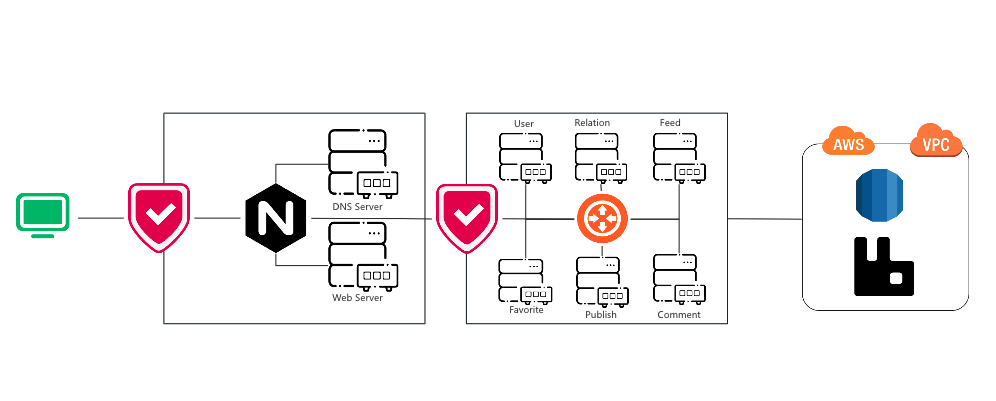

## BloomBlog  https://github.com/Agelessbaby/BloomBlog

A backend social media project using Kitex + Hertz + RPC + Kubernetes，supporting functionalities for publishing posts, adding comments, liking posts, and dynamically retrieving them in a feed-like manner

# Content
- [1：Main Features](#1main-features)
- [2：Description](#2description)
- [3：Database Schema](#3database-schema)
- [4：Code Arch](#4code-architecture)
- [5：Logical Arch](#5logical-architecture)
- [6：Physical Arch](#6physical-architecutre)
- [7：How to Use?](#7how-to-use)
## 1.Main Features

* Using **Kitex** as **micro services** framework and **Hertz** as HTTP Api gateway(both open sourced by bytedance)

* Using **AWS S3** as object storage

* Using **rabbitmq** as message queue

* Using **Docker** and **Kubernetes** as deployment

## 2.Description

| Service  | Description                          | Techniques            | Protocol | service registry |
|----------|--------------------------------------|-----------------------|----------|------------------|
| api      | Routing HTTP request to RPC Services | `Gorm` `Kitex` `Hertz` | `http`   | `CoreDNS`        |
| user     | User Management                      | `JWT`                 | `proto3` | `CoreDNS`        |
| relation | User Following Management            | -                     | -        | `CoreDNS`        |
| feed     | Posts Stream                         | -                     | -        | `CoreDNS`        |
| favorite | Favorite Management                  | -                     | -        | `CoreDNS`        |
| comment  | Comment Management                   | `rabbitmq`             | -        | `CoreDNS`        |
| publish  | Posts Publish Management             | `AWS S3`              | -        | `CoreDNS`        |
| dal      | Data Access Layer                    | `MySQL` `gorm`        | -        | `CoreDNS`        |


## 3.DataBase Schema

## 4.Code Architecture
| Directory                                                           | Sub Directory                                                                      | Description                                                                                                                                    | Remarks                                                                                                                                            |
|---------------------------------------------------------------------|------------------------------------------------------------------------------------|------------------------------------------------------------------------------------------------------------------------------------------------|----------------------------------------------------------------------------------------------------------------------------------------------------|
| [cmd](https://github.com/Agelessbaby/bloomblog/tree/main/cmd)       | [api](https://github.com/Agelessbaby/bloomblog/tree/main/cmd/api)                  | api gateway                                                                                                                                    | |
|                                                                     | [comment](https://github.com/Agelessbaby/bloomblog/tree/main/cmd/comment)          | comment service                                                                                                                                |
|                                                                     | [favorite](https://github.com/Agelessbaby/bloomblog/tree/main/cmd/favorite)        | favorite service                                                                                                                               |
|                                                                     | [feed](https://github.com/Agelessbaby/bloomblog/tree/main/cmd/feed)                | feed service                                                                                                                                   |
|                                                                     | [publish](https://github.com/Agelessbaby/bloomblog/tree/main/cmd/publish)          | publish service                                                                                                                                |
|                                                                     | [relation](https://github.com/Agelessbaby/bloomblog/tree/main/cmd/publish)         | relation service                                                                                                                               |
|                                                                     | [user](https://github.com/Agelessbaby/bloomblog/tree/main/cmd/user)                | user service                                                                                                                                   |
| [config](https://github.com/Agelessbaby/bloomblog/tree/main/config) | Config file for services and infrastructure                                        |
| [dal](https://github.com/Agelessbaby/bloomblog/tree/main/dal)       | [db](https://github.com/Agelessbaby/bloomblog/tree/main/dal/db)                    | Including Gorm operations and initialization                                                                                                   |
|                                                                     | [pack](https://github.com/Agelessbaby/bloomblog/tree/main/dal/pack)                | Packing Gorm struct into RPC struct                                                                                                            |
| [idl](https://github.com/Agelessbaby/bloomblog/tree/main/idl)       |                                                                   |protobuf idl file
| [kitex_gen](https://github.com/Agelessbaby/bloomblog/tree/main)     |                                                            |Code generated by Kitex 
| [util](https://github.com/Agelessbaby/bloomblog/tree/main/util)     | [mq](https://github.com/Agelessbaby/bloomblog/tree/main/util/mq)                   | Message queue used in [comment](https://github.com/Agelessbaby/bloomblog/tree/main/cmd/comment) service(could be expanded to other services)   |
|                                                                     | [errno](https://github.com/Agelessbaby/bloomblog/tree/main/util/errno)             | **error code**                                                                                                                                 |                                                                                   |
|                                                                     | [jwt](https://github.com/Agelessbaby/bloomblog/tree/main/util/jwt)                 | Using SHA256 and BASE64                                                                                                                        |
|                                                                     | [oss](https://github.com/Agelessbaby/bloomblog/tree/main/util/oss)                 | **AWS S3 oss**, compatible with minio                                                                                                          |
|                                                                     | [config](https://github.com/Agelessbaby/bloomblog/tree/main/util/config)           | **Viper** Reading configurations                                                                                                               |
| [config](https://github.com/Agelessbaby/bloomblog/tree/main/config) |                                                                                    | Config file for each service and infrasctructures                                                                                              |
|                                                                     | [kubernetes](https://github.com/Agelessbaby/bloomblog/tree/main/config/kubernetes) | Kubernetes description yaml files                                                                                                              |
| [script](https://github.com/Agelessbaby/bloomblog/tree/main/script) |                                                                                    | Shell Scripts for kubernetes deployment, setting up **Kind** cluster and executing some needed sql operations(not creating database or tables) |
|  | [kubernetes](https://github.com/Agelessbaby/bloomblog/tree/main/script/kubernetes) | Shell files that create and deploy kubernetes cluster, building and loading images, etc                                                        |
## 5.Logical Architecture


## 6.Physical Architecutre

## 7.How to Use?
### Prerequisite
1. Docker
2. Using a Linux or Mac machine(Win is ok but you need to change the scripts)
3. Having a AWS account and adjust the S3 Endpoint and bucket name to yours(in config/ossConfig.yaml)
   
4. Overwrite your AWS tokens in config/kubernetes/services/publish.yaml,make sure your IAM role has the access to S3
   
5. Install Swagger
   ```shell
   go install github.com/swaggo/swag/cmd/swag@latest
   ```
   Verify
   ```shell
   swag --version
   ```
   Init Api file
   ```shell
   swag init -g cmd/api/main.go
   ```
### Deploy
1. Make sure you have installed Docker on your machine
2. Install Kind - Kubernetes IN Docker <br>
   For Mac
    ```Shell
    brew install kind
    ```
   For Ubunut
    ```Shell
    sudo apt install kind
    ```
   Verify Installation
    ```shell
   kind --version
    ```
3. Grant executable permission to the .sh files
    ```shell
   chmod -R +x script/*
    ```
4. Create Kubernetes Cluster
    ```shell
   kind create cluster --config ./config/kubernetes/cluster-bloomblog.yaml
    ```
   Verify creating cluster
    ```shell
   kubectl cluster-info --context kind-bloomblog
   ```
   You should see output like
   
5. Build Docker images
   ```shell
   ./script/kubernetes/build_images.sh
   ```
6. Loading images into Kubernetes cluster
   ```shell
   ./script/kubernetes/kind/load_images.sh
   ```
7. Deploy Infra(Mysql,Rabbitmq)
   ```shell
   ./script/kubernetes/deploy-infra.sh
   ```
8. Deploy Services
   ```shell
   ./script/kubernetes/deploy.sh
   ```
   
9. Start a kubernetes job 
   ```shell
   kubectl apply -f config/kubernetes/infra/jobs/add_casscade.yaml
   ```
   
10. Verify Deployment<br>
   Verify Pods
   ```shell
   kubectl get pod
   ```
   Verify Services
   ```shell
   kubectl get service
   ```

### Run
1. Use Swagger to debug<br>
   [Swagger](http://127.0.0.1:8088/swagger/index.html#/)<br>
   For Publish service, Swagger doesn't support multi files upload, youcan use this postman link<br>
   [Postman](https://sgwego.postman.co/workspace/56d21fd2-91e0-44e8-a254-2686280fab74/request/37806888-b5c50b37-48e6-4eac-ad9d-ac06312d2de7?action=share&source=copy-link&creator=37806888&ctx=documentation)

### Future
1. You can build your own frontend based on this project, the frontend is still developing
2. I intended to build this project using cloud native solution, however the price for Amazon Mq and NAT is so expensive, you can build it yourself if the budget permits
3. Now there is only RDBMS, decided that to later apply nosql to build a cache aside architecture
4. The logstash filter is a little bit hard, still working on it.This is for to collect the database queries that exceed the time threshold